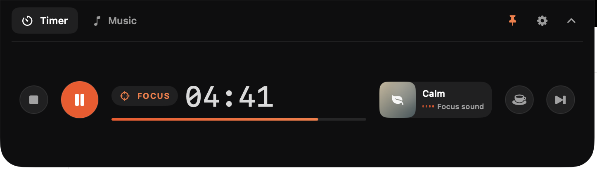
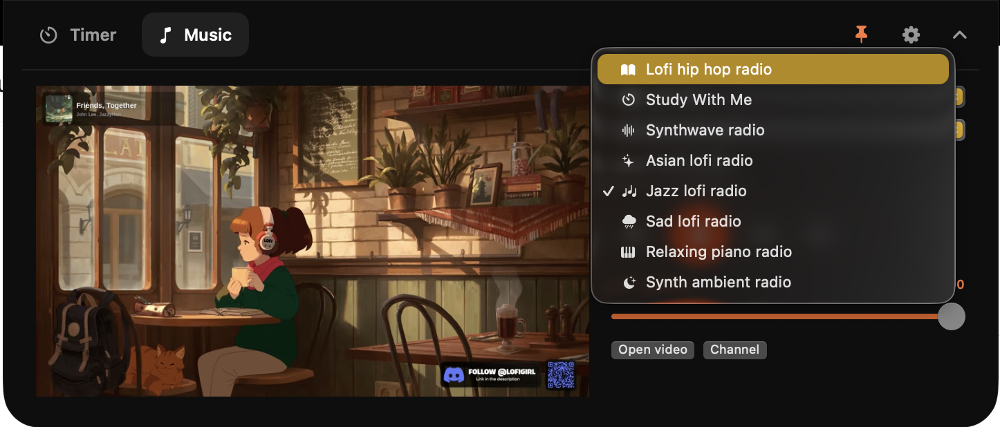
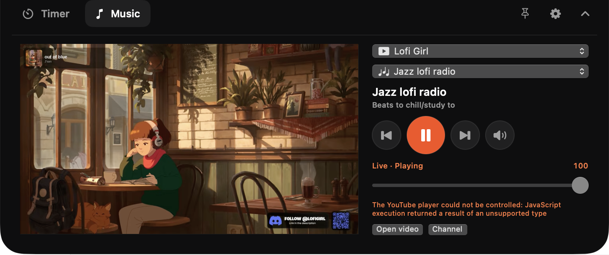
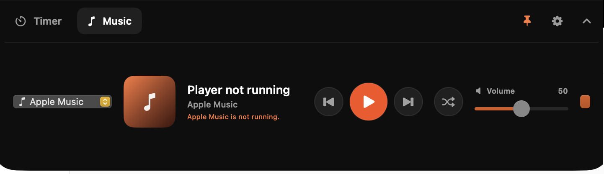

# Hocus Focus

**A quiet focus companion that lives in your MacBook notch.**

Hocus Focus turns the small space you already glance at all day into a calm home for your timer and music. Start a session, choose the sound that fits the moment, and get back to what matters—without opening another window or breaking your flow.

<p align="center">
  
</p>

## Focus without leaving your flow

Your current session is always one glance away. Hocus Focus stays beautifully compact when you are working, then expands when you need controls. Start, pause, reset, skip ahead, or take a coffee break without hunting through menus.

<p align="center">
  
</p>

Set a rhythm that works for you: focused work, short breaks, and dedicated coffee breaks. The timer keeps honest time even when your Mac sleeps, and a gentle notification brings you back when a session ends.

## Make focus sound good

Some days call for rain. Others need jazz, soft ambience, or a familiar playlist. Hocus Focus keeps all of it in the same small space as your timer.

- Choose from six built-in focus soundscapes: Calm, Rain, Study, Jazz, Cozy, and Lo-Fi.
- Tune into eight Lofi Girl live stations, from classic study beats to synthwave, piano, jazz, and rainy-day moods.
- Control Apple Music without pulling yourself into the full Music app.
- Keep listening while the notch collapses or you switch back to the timer.

### A Lofi Girl station for every kind of session

<p align="center">
  
</p>

Pick the energy you need and let it run. The main Lofi Girl study stream is ready by default, while the station picker makes it easy to move from deep-focus beats to a softer evening atmosphere.

<p align="center">
  
</p>

### Your Apple Music, close at hand

<p align="center">
  
</p>

Play, pause, skip, shuffle, and adjust volume directly from the notch. You can see what is playing and stay with your work instead of disappearing into your library.

## Designed to disappear at the right moment

Hocus Focus is present when it helps and nearly invisible when it does not.

- **Glanceable by default.** See the current mode and remaining time without opening anything.
- **Expandable on demand.** Hover or click when you want the full timer or music controls.
- **Easy to keep around.** Pin the expanded view while planning a session, then collapse it when it is time to work.
- **No Dock clutter.** Hocus Focus lives in the notch, with a small menu-bar fallback when you need it.
- **Personal by design.** Your preferences stay on your Mac, and there is no Hocus Focus account to create.

## Built for the way focus actually works

Focus is not one perfect 25-minute block. It is starting when you feel resistance, protecting momentum once it arrives, and taking a real break before your attention runs dry. Hocus Focus keeps those small decisions close enough to be effortless—so the tool fades away and the work gets your attention.

## Run Hocus Focus on your Mac

Hocus Focus is a personal macOS app for Apple silicon Macs running macOS 14 or later.

```bash
./scripts/build-app.sh
open "dist/Hocus Focus.app"
```

The first time you use certain features, macOS may ask for permission to send timer notifications or control Apple Music. Lofi Girl playback uses YouTube's embedded player and needs an internet connection; the built-in focus soundscapes work offline.
